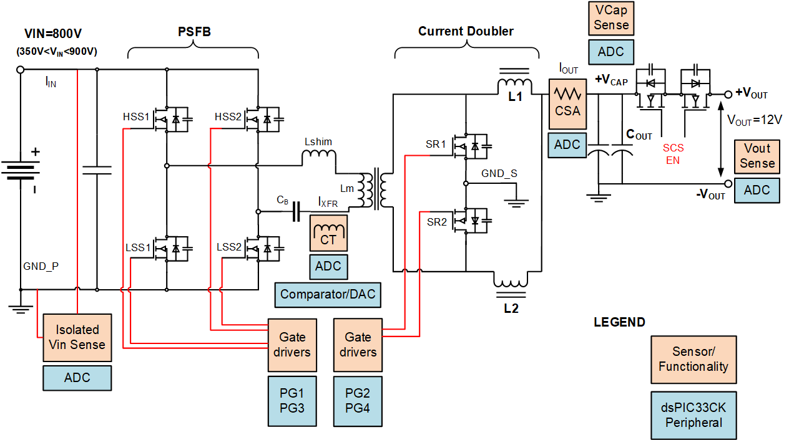
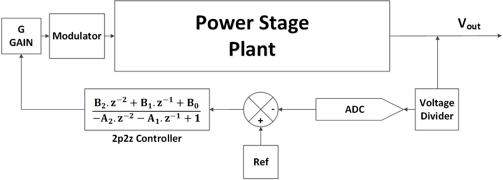
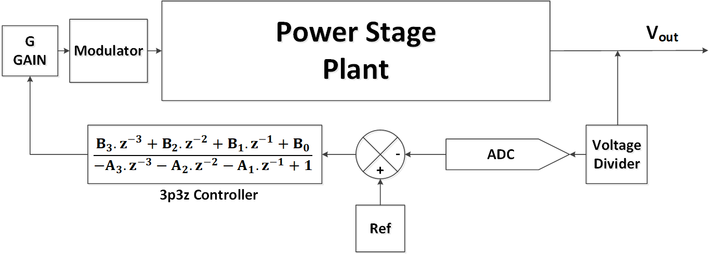
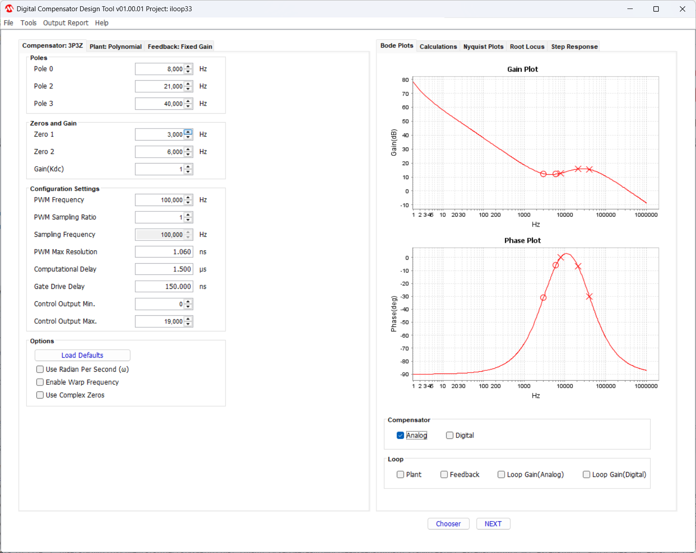
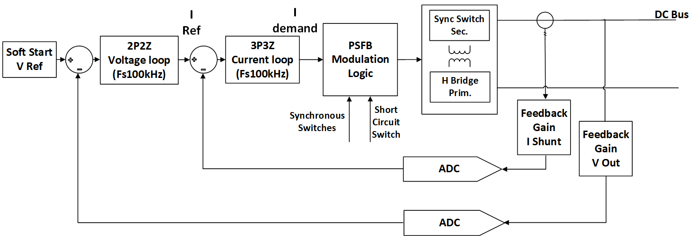
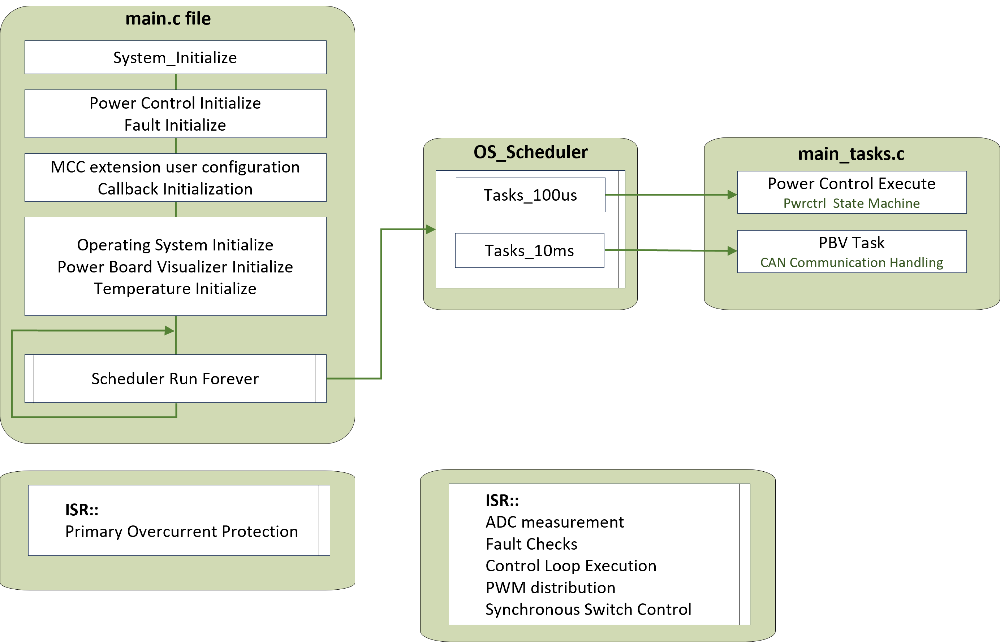
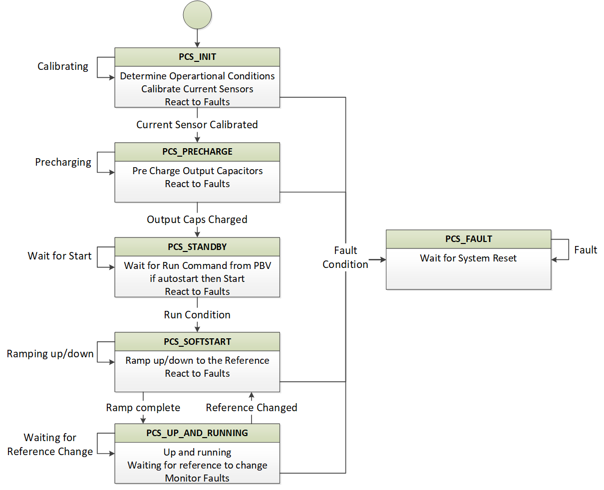
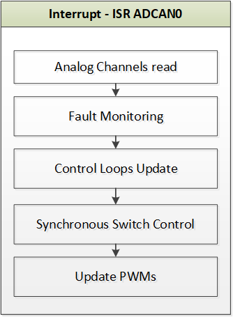
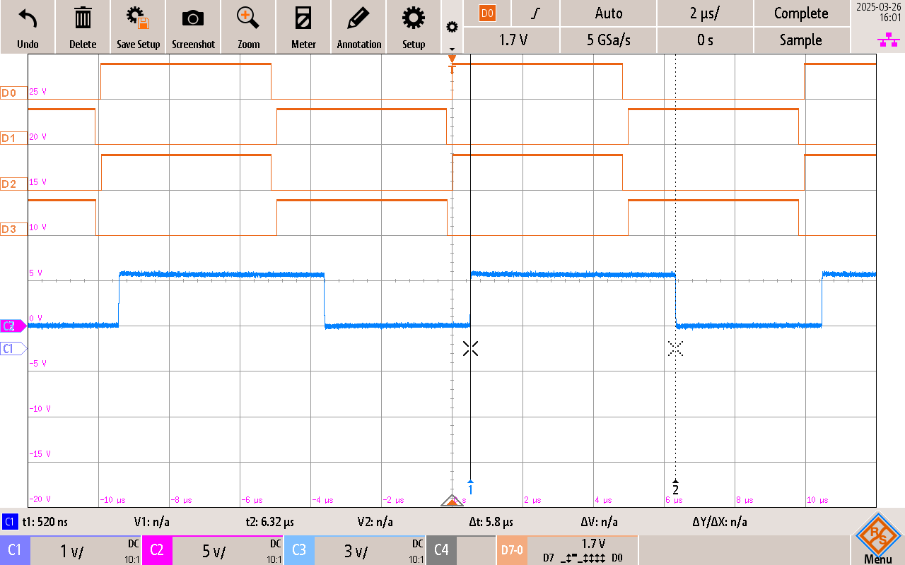

# Firmware Overview

Microcontroller-based Switch Mode Power Supplies need to be both real-time and deterministic, while also taking advantage of the flexibility offered by programmable microcontrollers. The firmware for these power supplies handles various tasks, some of which must be deterministic, while others, being less critical, do not require deterministic execution. This design approach is evident in the use of interrupts and the repetition of tasks at different frequencies. These aspects will be explored in detail in the Firmware Structure and Implementation section later.

## Firmware components

<a target="_blank" rel="nofollow" href="images/sensors.png">

</a>

<a target="_blank" rel="nofollow">
Overview of the sensors and microcontroller peripherals used in power transfer
</a>

The Firmware for PSFB DCDC Converter has the following components
### Input/Output Rail Sensing
When designing a power converter, it's crucial to keep an eye on both the input and output voltages and currents. This is done by scaling the voltages to levels that the microcontroller's ADC sense lines can handle. The input current is measured with a current transformer, while the output current is detected using a shunt amplifier. Both of these current measurements are then converted into voltage signals that the analog sense lines can process. 

##### Peripheral Used : High Speed 12-bit Analog to Digital Converter(ADC)
The dsPIC33CK256MP506 devices have a high-speed, 12-bit Analog-to-Digital Converter (ADC) that features a low conversion latency, high resolution and oversampling capabilities to improve performance in AC/DC, DC/DC power converters. The devices implement the ADC with three SAR cores, two dedicated and one shared. Two of these cores are faster dedicated cores which are dedicated to specific channels and are used to sample the input and output currents. The other core, which is a shared core between a higher number of channels, is used to sample the input and output voltages. 

The table lists all the analog channels of the PSFB converter

|     S.no    |     Net name          |     MCU details                                                                                               |     Description                                 |     Sampling   Trigger                          |     Sampling Rate                       |
|-------------|-----------------------|---------------------------------------------------------------------------------------------------------------|-------------------------------------------------|-------------------------------------------------|-----------------------------------------|
|     1       |     FB_P_CT_FILT      |     Dedicated Core 0 Conversion Time: 328ns                                                                   |     Primary Current.   Sensed through a CT.     |     Sampled during half   of the Duty Cycle.    |     Sampled Cycle by   Cycle, 100kHz    |
|     2       |     I_SEC_AVG_FILT    |    Dedicated Core 1 Conversion Time: 328ns                                                                    |     Output Current.   Sensed through Shunt.     |     Sampled during half   of the Duty Cycle.    |     Sampled Cycle by   Cycle, 100kHz    |
|     3       |     FB_VOUT           |     Shared Core    Channel 2    Conversion Time: 470ns                                                        |     Output Voltage    Shared Core, Channel 2    |     Sampled during half   of the Duty Cycle     |     Sampled Cycle by   Cycle, 100kHz    |
|     4       |     VIN_INT_AN        |     Shared Core    Channel 10    Conversion Time: 670ns     (value available after 670ns after triggering)    |     Input Voltage                               |     Software Trigger                                |     Sampled Cycle by   Cycle, 100kHz    |
| 5           | FB_VCAP               |     Shared Core    Channel 9    Conversion Time: 470ns     (value available after 470ns after triggering)      | Output Capacitor Voltage                        | Software Trigger                                    | Sampled Cycle by Cycle, 100khz          |
| 5           | FP_TEMP               |     Shared Core    Channel 14    Conversion Time: 900ns     (value available after 900ns after triggering)      | Temperature Sensor                              | Software Trigger                                    | Sampled Cycle by Cycle, 100khz          |
| 6           | FB_5V                 |     Shared Core    Channel   19  Conversion Time: 1400ns     (value available after 1388ns after triggering)      | 5 Volt Rail                                     | Software Trigger                                    | Sampled Cycle by Cycle, 100khz          |

#### Sensor calibration at startup

Input and Output Current sensors both have offsets of about 500mV. These are measured before power transfer.

### PWM Signals for Phase Shifted Operation
In phase shifted design, the power transfer happens by the phase shift between the left and right legs of the bridge. Due to this phase shift a bipolar voltage appears at the primary of the transformer. 
##### Peripheral Used: PWM Generator
The control signal directed to the power stage is determined by the phase shift value between the fixed and phase-shifted legs. The primary side switches are actuated using the High-Resolution Pulse Width Modulation (PWM) with fine edge placement peripheral of the dsPIC33CK microcontroller. This peripheral is exceptionally versatile, facilitating the execution of intricate modulation schemes autonomously within the controller's core-independent peripheral. During phase-shifted operation, the phase-shifted leg is synchronized with the fixed leg. A delay or phase shift is introduced to generate a bipolar voltage at the transformer, utilizing a highly adaptable trigger mechanismThis phase-shift is the control output from the compensator to the power stage.  For more details on the workings of the PWM Peripheral, refer to the PWM Family Reference Manual.
The Trigger mechanisms are summarized in the table below.

|      PWM Generator Number    |                                     Details                                    |                           Function                          |                        Start of Cycle Trigger                       |                                  Peripheral Setting                                |
|:----------------------------:|:------------------------------------------------------------------------------:|:-----------------------------------------------------------:|:-------------------------------------------------------------------:|:-------------------------------------------------------------------------:|
|     PWM Generator 1 (PG1)    |     Complimentary PWM at 100Khz    at 50% Duty Cycle                           |     Generating Signals for the Fixed Leg of PSFB            |     Self-Running                                                    |     PG1 End of Cycle                                                      |
|     PWM Generator 3 (PG3)    |     Complimentary PWM at 100Khz    at 50% Duty Cycle                           |     Generating Signals for the Phase Shifted Leg of PSFB    |     Phase Delayed and Synchronized to PG1                           |     Trigger Value from PG1                                                |
|     PWM Generator 2 (PG2)    |     Complimentary PWM at 100Khz,    Swapped.     Only High Side signal used    |     Generating the Synchronous rectifier signal for SR2     |     Synchronized to PG3.      Duty Cycle = Period – Phase Delay     |     Trigger value from PG3 and swapping the high and low side signal.     |
|     PWM Generator 4 (PG4)    |     Complimentary PWM at 100Khz,    Swapped.     Only High Side Signal used    |     Generating the Synchronous rectifier signal for SR1     |     Synchronized to PG1.    Duty Cycle = Period – Phase Delay       |     Trigger value from PG1 and swapping the high and low side signal.     |

#### Seconndary Rectifiers DCM/CCM
The PWM signals for the Secondary Rectifiers are generated using PWM Generator 2 (PG2) and PWM Generator 4 (PG4). The decision to turn on and off Secondary Rectifiers depends upon the load current. If the load current is high enough for CCM operation, then the Secondary rectifiers are turned on, otherwise the body diodes of the secondary side MOSFETs are used.

### Compensation and Control
The changes to the input and output voltages and/or currents must not affect the stability of the system or damage the connected load. To ensure the integrity of the operation, the changes to the output and input voltages and currents are compensated for by using established control theory practices.

#### Compensator
The 2-pole/2-zero and 3-pole/3-zero are digital implementations of type II analog and type III analog compensators. These are filters designed to introduce specific gain and phase boosts by strategically placing poles and zeros in the frequency domain. 

<a target="_blank" rel="nofollow" href="images/2p2z.png">

</a>

<a target="_blank" rel="nofollow">
Digital implementation of type 2 Analog controller
</a>

<a target="_blank" rel="nofollow" href="images/3p3z.png">

</a>

<a target="_blank" rel="nofollow">
Digital implementation of type 3 Analog controller
</a>

#### DCDT SMPS Control Library
The Analog controllers of two poles two zeros, and three poles three zeros are implemented in the digital domain by transforming the compensator transfer function from the s-domain to the z-domain. 

The Digital Compensator Design Tool (DCDT), a complimentary plugin available within the MPLAB X Integrated Development Environment (IDE), is employed to determine the digital compensator coefficients by entering the location of Poles and Zeros in frequence domain. Based on the locations of the poles and zeros, the coefficients for the z-domain equation are computed. 

These coefficients are utilized within the Switched-Mode Power Supply (SMPS) control library, which is also provided free of charge by Microchip. The SMPS control library offers efficient and high-speed assembly libraries to facilitate the updating of control loops. For more information on DCDT refer to the [DCDT’s webapage.](https://www.microchip.com/en-us/development-tool/dcdt)

<a target="_blank" rel="nofollow" href="images/DCDT.png">

</a>

<a target="_blank" rel="nofollow">
Digital Compensator Design Tool
</a>

#### Voltage Loop
A fundamental approach to regulating the output voltage involves the implementation of a voltage loop. This voltage loop continuously monitors the output voltage for any deviations and compensates for these fluctuations by adjusting the duty cycle applied to the plant. However, relying solely on the voltage loop is often insufficient due to its inherently slow response time. Additionally, the voltage loop lacks the capability for cycle-by-cycle current control, which is critical for maintaining precise and stable operation. A cascaded approach is essential that employes both a current loop and a voltage loop.

#### Current Loop
To address the limitations inherent in the voltage loop, the inclusion of a current loop is essential. In the context of this design, two methodologies for current loops were evaluated: Peak Current Mode Control and Average Current Mode Control

#### Average current mode control vs Peak Current Mode Control
In this design, the Average Current Mode is chosen. Average Current Mode Control provides various advantages in the context of Power Converter methodology, such as easier control schemes, working better with droop control methods, and providing more flexibility for maximum efficiency as it gives more control over edge positions.  
Peak Current Mode Control (PCMC) has its own advantages, such as rapid transient response and reduced computational workload on the CPU.   
The fundamental difference between PCMC and Average Current Mode Control (ACMC) lies in managing transformer magnetization and current regulations.  
PCMC aims to prevent staircase saturation by ensuring equal currents, whereas ACMC achieves this by enforcing equal on-times to maintain balanced magnetization in the transformer. PCMC requires a highly symmetric current sense signal. On the contrary, ACMC is more tolerant of imprecise feedback, if the half-bridges respond uniformly.  
In well-designed systems, the switch timings of each bridge are typically synchronized, making ACMC a straightforward approach due to its leniency towards feedback signal symmetry. This tolerance simplifies the design process, as achieving a perfectly symmetric current feedback signal is not always feasible. 

#### Complete Control Scheme
The diagram illustrates the comprehensive control scheme for the PSFB DCDC converter. The outer voltage loop acquires its reference through a soft-start mechanism, wherein the reference is incrementally ramped up. This outer voltage loop subsequently provides a reference to the internal current loop. Both control loops operate on a cycle-by-cycle basis.

<a target="_blank" rel="nofollow" href="images/4kW_control.png">

</a>

<a target="_blank" rel="nofollow">
4kw Control
</a>

### Fault Handling
There are two levels of Fault monitoring and handling. 
#### Hardware based fault monitoring
The primary over current Fault handling is done by monitoring the input current using a comparator. 

##### Peripheral Used: High Speed Analog comparator with slope compensation DAC
dsPIC33CK has high speed analog comparator with slope compensation DAC. The Primary Overcurrent condition will trigger a fault, which will stop switching on the primary side. The secondary rectifiers will be turned off as soon as the current falls below a certain threshold.  insert slider details
#### Software based fault monitoring
The Primary Over/Under Voltage, Secondary Over/Under voltage, Secondary Overcurrent, and Over Temperature are sensed through ADC and monitored for fault conditions every PWM cycle of the fixed leg. The fault response is the same as the hardware fault response, i.e. turn off the PWM signals for fixed and phase shifted legs. Secondary side switches are turned off when the current falls below CCM/DCM threshold.

### Communication and Visualization
The PSFB has an isolated CAN-FD interface. The design is intended to work with Power Board Visualizer. With Power Board Visualizer the important parameters and the current state of the PSFB can be observed in real time. The output voltage reference can also be changed using a voltage slider.

#### Peripheral Used: Controller Area Network (CAN FD) Module
dsPIC33CK comes with a highly versatile CAN FD module. The transmission and receiving of messages are taken care of by the peripheral.

The complete information about the CAN-FD messages can be seen by clicking the info tab of the PBV Project.

### House Keeping
The system monitors additionally the five-volt line, as well as the system temperature. Overtemperature, or a dip in five-volt line will also generate a fault condition.

## Implementation

### Firmware Architecture
The firmware architecture uses a simple yet effective task scheduler. This simple task scheduler enables different tasks to run at different frequencies. The system tick is generated by using the Timer 1 of the dsPIC33CK.

<a target="_blank" rel="nofollow" href="images/arch.png">

</a>

<a target="_blank" rel="nofollow">
Firmware Architecture
</a>

#### Power Supply State Maching
The state machine of the Power supply is updated every 100us using the 100us task update of the scheduler. 

<a target="_blank" rel="nofollow" href="images/states.png">

</a>

<a target="_blank" rel="nofollow">
Power Supply State Machine
</a>

##### PCS_INIT
Initial State of the power converter. In this state the sensor offsets are measured, and the system transtions for PCS_PRECHARGE State

##### PCS_PRECHARGE
Next State of the power converter. here the converter waits for the Start Precharge command from PBV. After the Precharge, it stays in this state, and waits for the Start Power Transfer command from the PBV.

##### PCS_STANDBY
In this state all the controllers are Initialized. And then the control of the switches is handed over to Control loops, and the SR control is handed over to DCM/CCM monitor

##### PCS_SOFTSTART
In this state, the Voltage reference to the loop is ramped up and down.

##### PCS_UP_AND_RUNNING
In this state, the controller maintains the output voltage to the setpoint from Power Board Visualizer. In case the user changes the voltage reference from PBV using the voltage reference slider, the refernce is incremently/decremently applied to the voltage loop in the PCS_SOFTSTART state.

##### PCS_FAULT
In any fault condition, the primary side switches are turned off. The output current is allowed to dissipate, and then the Secondary Rectifiers are turned off. The system is taken out of Fault condition by clicking the Fault Reset button on PBV. Note that if the conditions for fault exist, then the system will immediately jump back into fault state.

#### Interupt Based Control Update
In parallel to Statemachine, an interrupt is generated synchronized with the fixed leg PWM signal. Here all the analog values are updated. These are triggerd as described above. Based on these values faults are monitored, and control loop's feedbacks are updated, and new control loops output values are used to update the PWM Duty Cycles.

The secondary side current read here is also responisble to determine the CCM/DCM conditions. The Secondary Rectifiers are switched on and off based on the output current.

<a target="_blank" rel="nofollow" href="images/int.png">

</a>

<a target="_blank" rel="nofollow">
Functions in Interrupt 
</a>

#### Control Loop timing/interrupt timing

<a target="_blank" rel="nofollow" href="images/latency.png">

</a>

<a target="_blank" rel="nofollow">
Interrupt Latency
</a>

### Peripheral Initalization and Device Drivers

#### Microchip Code Configurator
Microchip Code Configurator (MCC) is a user-friendly software tool designed to simplify the development process for embedded applications. It offers a graphical interface that allows developers to easily configure and generate initialization and application code for Microchip's 8-bit, 16-bit, and 32-bit microcontrollers. By automating the setup of peripherals and libraries, MCC enables developers to concentrate on creating their application logic, reducing development time and effort. 
MCC is used to configure all the peripherals of the dsPIC33CK for this project. 

MCC comes bundled together with MPLAB X Ide. To visualize the periphreal settings for this projects please click on MCC icon from the toolbar of MPLAB X Ide, once the project has been opened.

---

&copy; 2025, Microchip Technology Inc.

---

