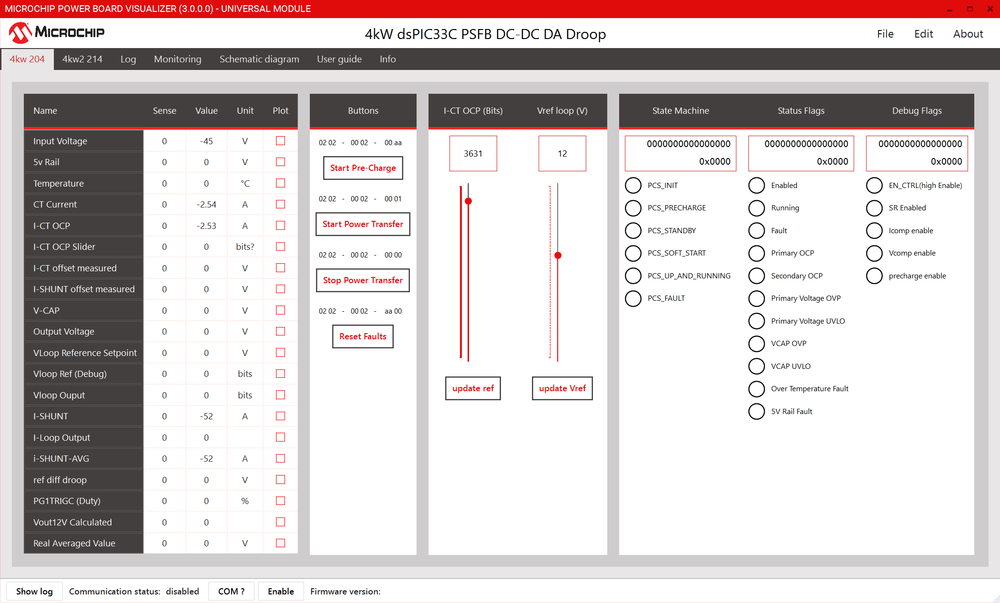
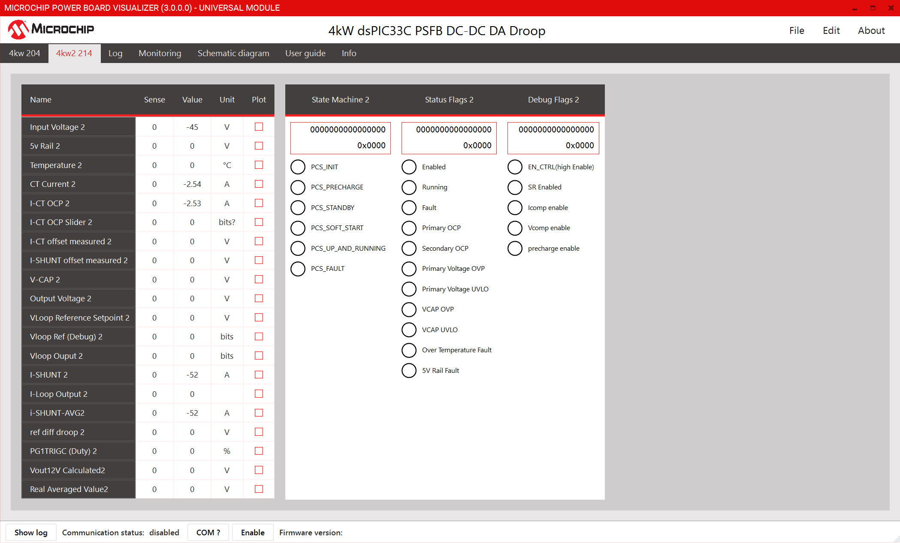

# Parallel/Droop Operation
## Theory

Droop control is a widely used technique in power electronics and power systems for enabling multiple power sources—such as power supplies, converters, or generators—to share load current proportionally when operating in parallel. The primary objective of droop control is to ensure stable and balanced load sharing without the need for direct communication or synchronization between the sources.

**Principle of Operation**

In an ideal parallel system, all power sources would maintain exactly the same output voltage, ensuring equal current sharing. However, due to inevitable differences in component tolerances, wiring, and layout, small variations in output voltage can occur. These differences can lead to circulating currents, where one source supplies more current than others, potentially causing overheating or inefficiency.

Droop control addresses this issue by intentionally allowing the output voltage of each power source to decrease (or "droop") as the output current increases. This is typically achieved by introducing a small, controlled resistance—either physically or through control algorithms—into the output path. The result is a linear relationship between output current and output voltage:

$$
V_{out} = V_{ref} - (I_{out} \times R_{droop})  
$$

Where:

Vout is the output voltage,  
Vref is the reference voltage,  
Iout is the output current,  
Rdroop is the droop resistance. 

**Load Sharing Mechanism**

As the load increases, each power source’s output voltage drops slightly according to its droop characteristic. If one source begins to supply more current than the others, its output voltage will decrease further due to the droop effect. This lower voltage causes the other sources, whose output voltages are now relatively higher, to supply more current, thereby redistributing the load. This self-regulating mechanism ensures that all sources contribute to the load in proportion to their droop settings and rated capacities. Properly designed droop characteristics help prevent any single source from becoming overloaded and promote stable, balanced operation without the need for direct communication or centralized control.

## Implementation

### Droop Coefficient Calculation

1. **Output Current Range:**  

   $$
   \text{Maximum output current} = \frac{2700W}{15V} = 180A
   $$

   Output Current Range is 180 amps.

2. **Droop Coefficient Rd:**  
   Desired Droop Voltage is 1 Volt over entire voltage range. This was selected 
   $$
   R_d = \frac{1V}{180A}
   $$

   $$
   R_d\,\text{counts} = \frac{1V \times 154\,\text{mV}/V \times 4095 / 3.3}{180A \times 10\,\text{mV}/A \times 4095 / 3.3}
   $$

   where 154mV/V is the gain of the output voltage feedback, and 10mV/A is the gain of the output current sensor.

   $$
   R_d\,\text{counts} = \frac{1V \times 154\,\text{mV}/V}{180 \times 10\,\text{mV}/A} = 0.0855\,\text{counts}
   $$

3. **Validation:**

    For a current of 180 amps ADC reads 
    $$
    {180A \times 10\,\text{mV}/A \times 4095 / 3.3 = 2233.63}
    $$

    multiplying this with Rout

    $$
    {2233.63 \times 0.0855 = 190.97 \approx 191}
    $$

    191 is the range of change of Output Voltage reference in raw ADC units. This results in voltage reference change of

    $$
    \frac{191 \times 3.3}{4095} \times \frac{1}{154\,\text{mV}/V} = 0.999 V
    $$

### Calibration and scaling factor
The Standalone implementation of the PSFB uses the output voltage reference value from PBV. To ensure the correct operation, every board recieves the same voltage reference setpoint, at the same time. The reference value is the _calculated_ adc count value. Due to inevitable differences in component tolerances, wiring, and layout, each board will have its own _measured_ adc value, which will be different from the calculated one. To overcome this, external calibration of the output voltage rail is required. This is done by connecting an external 12 volt supply to the output voltage rail before turning on the boards.

### Droop Implementation

The state machine implementation is similar to the single board operation. 

During the Up and Running State, a new Vref is calcualted every 100ms as per

$$
V_{ref'} = V_{ref PBV} - (I_{out} \times R_{droop})  
$$

Iout is the average output current for that power module. The new Vref setpoint causes the State machine to jump back into the Soft Start state, where it slowly ramps down the Vref.

## How to operate in Droop Mode
### Preparing DP-PIMs

To demonstrate droop mode, two PSFB modules are required. Since there is no communication between the two PSFB modules, the same code base is used for both. However, to effectively read the debug data on PBV from each board, the CAN ID of outgoing messages must be changed.

An example XML file is provided with the firmware package, where one set of signals is decoded on CAN ID 0x204, and the other set is decoded on CAN ID 0x214. Both boards receive control inputs on the same CAN ID, ensuring that both operate in sync.

To set up the demonstration, program one DP-PIM with the psfb_droop.X project as provided. For the second DP-PIM, modify the CAN ID in the source file sources/app/app_PBV_psfb_frame_map.c by changing the PBV_SYSTEM_TO_GUI_ID define to 0x214. Rebuild the project and program the second DP-PIM with this modified firmware.

### Calibration

Before startup, that is, before input voltage is applied—the output voltage sense must be calibrated. Calibration is performed as follows. Note: At this point, it is helpful to have the PBV project open and CAN communication enabled to view the debug data from both boards.

1. Connect the output voltage rails of both modules in parallel.
2. Connect a 12-volt supply to the output voltage rail.
3. Insert the voltage adapter into the barrel jack for the auxiliary supply. Press the reset button to reset the controller. As soon as the controller receives power, it calibrates the output resistor stage and stores the coefficient.
4. Remove the external 12 V supply.

### PBV Control

After calibration, follow these steps to start the board:

1. Open the PBV project file: 4KW dsPIC33C PSFB DC-DC DA.xml.
2. Select the correct communication port and enable it.
3. Verify that everything is set up correctly by checking the status/housekeeping data and ensuring the system is in the PCS_PRECHARGE state. 
4. Click on "Start Precharge." The system will charge the output capacitors in open loop.
Note that, at this point, the output stages are in open loop, so there may be disproportionate load sharing.
5. Click on "Start Power Transfer." The system will quickly transition through various states and should eventually reach the PCS_UP_AND_RUNNING state. At this stage, both systems will share the load.
6. Change the reference to the desired output voltage value if necessary.

<a target="_blank" rel="nofollow" href="images/droop_pbv_204.png">

</a>

<a target="_blank" rel="nofollow">
Power Board Visualizer GUI - CAN ID 0x204
</a>

<a target="_blank" rel="nofollow" href="images/droop_pbv_214.png">

</a>

<a target="_blank" rel="nofollow">
Power Board Visualizer GUI - CAN ID 0x214
</a>

