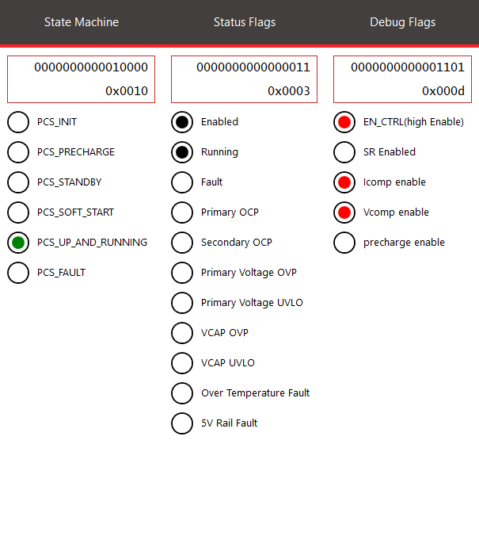

 


--- 
# 4kW dsPIC33C PSFB DC-DC Demonstration Application

<p><center><a target="_blank" rel="nofollow">
<p>

</a>
</center>
</p>

<p>
<center>
<a target="_blank" rel="nofollow">
dsPIC33C PSFB DC-DC DA
</a>
</center>
</p>

---

## Summary

The dsPIC33C Phase Shifted Full Bridge Demonstration Application (PSFB DA) is a development platform designed for quick prototyping and software development, utilizing the Microchip dsPIC33C DSP MCU and Silicon Carbide (SiC FET) Technology. This board is primarily aimed at 800V to 12V automotive OBC DCDC converter applications but is also suitable for other industrial or telecom applications requiring high voltage on the primary side and high current on the secondary side.

The board features well-organized circuit sections, including an input EMI filter and protection, SiC primary PSFB, auxiliary power supply, CAN communication, and a socket for Microchip’s latest Digital Power Plug-In Modules (DP PIMs). The pinout is compatible with CK, CH, and the new AK dsPIC® DSC DP PIMs.

---

## Related Documentation

__Firmware Documentation__

- [Online Firmware Documentation of this Code Example](./index.html)

__Hardware Documentation__

- [4kW dsPIC33C PSFB DC-DC application demonstration user's Guide]()
- [4kW dsPIC33C PSFB DC-DC application demonstration operational manual]()

__Target Device Documentation__

- [dsPIC33CK256MP508 Family Data Sheet](https://www.microchip.com/70005349)
- [dsPIC33CK256MP508 Family Silicon Errata and Data Sheet Clarification](https://www.microchip.com/80000796)

__Please always check for the latest data sheets on the respective product websites:__

- [dsPIC33CK256MP508 Family](https://www.microchip.com/dsPIC33CK256MP508)
- [dsPIC33CH512MP508 Family](https://www.microchip.com/dsPIC33CH512MP508)

## Software Used

- [Power Board Visualizer GUI](https://www.microchip.com/en-us/software-library/power_board_visualizer)
- [MPLAB&reg; X IDE v6.20](https://www.microchip.com/en-us/tools-resources/develop/mplab-x-ide)
- [MPLAB&reg; XC-DSC Compiler v3.10](https://www.microchip.com/en-us/tools-resources/develop/mplab-xc-compilers/xc-dsc)
- [Microchip Code Configurator v5.5.1](https://www.microchip.com/mplab/mplab-code-configurator)
- [Digital Compensator Design Tool](https://www.microchip.com/developmenttools/ProductDetails/DCDT)
  
---


## Quick Start Guide
This section is designed to assist users in powering up the board using Power Board Visualizer after completing the hardware connections. It does not cover the hardware connection process itself. Please ensure that the load source connections are correct and that the operation is free from hazards. For detailed information, please refer to the user guide.

## Directory Structure

```
	├───psfb.X							        PSFB main project 
	├───images									Images for the Readme 
	├───power_board_visualizer_xmls				Power Board Visualizer Projects
	├───pre_compiled_hex_files					Pre compiled Hex file
	└───docs									doxygen files
```
---

## Programming Hex File on to the dsPIC33C Digital Power PIM using available hex file
In this example ICD4 is being used, but any of the available debuggers/programmers can be used.

1. Open <i>MPLAB X IPE</i>
2. Select the device on DP-PIM : <i>dsPIC33CK256MP506</i>
3. Connect computer to ICD4 via USB cable, connect ICD4 to 6 pin header on DP-PIM via RJ11 cable and RJ11 to ICSP adapter.
4. Power the dpPIM through a microUSB cable.
5. Click <i>Connect</i> on the MPLAB X IPE
6. Wait for the device to connect
7. Navigate to the folder pre_compiled_hex_files, and select the correct hex file
8. Click <i>Program</i>
9. Wait for the program/verify complete message.
10. Disconnect programmer from Digital Power Plug-in Module.


### Power Board Visualizer Hardware Setup

To establish CAN communication between the PC and the PSFB board, a USB to CAN dongle is required. It is important to note that the Power Board Visualizer is compatible only with PEAK System USB CAN-FD dongles. Additionally, an RS232 DB9 straight-through cable is could be used to connect the power board to the PEAK dongle.

### Powering On board through Power Board Visualizer
#### Prerequisites
Following software must be installed on your pc to control/communicate between Power Board Visualizer and dsPIC33CK.
 - Power Board Visualizer V2
 - Peak System USB Drivers

#### Setting up and Connecting the Power Board Visualizer
After completing the hardware setup, go to the power board visualizer XMLs folder. Open the appropriate project using Power Board Visualizer. Once the project is open, you will see the following screen.

<p><center><a target="_blank" rel="nofollow" href="images/psfb-pbv.jpg">
<p>

</a>
</center>
</p>

<p>
<center>
<a target="_blank" rel="nofollow">
Power Board Visualizer GUI
</a>
</center>
</p>


1. Table to monitor the system values in real time
2. Buttons to start/stop power transfer
    - Start Pre Charge  - This button starts the precharging of the output capacitors in open loop mode. The capacitors have to be precharged before the Start power Transfer is activated.
    - Start/Stop Power Transfer - These buttons turn on and off the power transfer by enabling or disabling the primary side switches. 

3. Sliders to provide reference values
    - Voltage Output Reference Slider - This slider is used to set reference value for output voltage. Ensure to press the Set button below the slider to communicate the reference value to the microcontroller.
    - I-CT OCP Slider - This slider sets the input over current protection value.
4.	System State and debug information.
    - PSFB Controller State - This section displays the current state of the system. Detailed information about each state and the state machine can be found in the Firmware Overview section.
    - PSFB Status Flags - This section lists the high-level state of the system and any fault conditions that occur.
5.	Communication status and COM Selector
	- The "COM?" button lists all available communication ports for the PBV. If the Peak Dongle drivers are installed and the Peak USB dongle is connected, it will appear as PCAN_USB:FD. Select the appropriate port and click enable. The Power Board Visualizer will then open the selected Comm port.

    
#### Sequence of Actions to Power On
After opening the appropriate Power Board Visualizer project, follow these steps to start the board:

1. Select the correct communication port and enable it.
2. Verify that everything is set up correctly by checking for status/housekeeping data and ensuring the system is in the PCS_PRECHARGE state. Confirm that the correct operation mode is programmed by examining the status flags.
3. Click on "Start Precharge". The system will charge the output caps in open loop.
4. Click on "Start Power Transfer". The system will quickly transition through various states and should eventually reach the PCS_UP_AND_RUNNING state.
5. Change the reference to desired output voltage value if necessary.

<p><center><a target="_blank" rel="nofollow" href="images/Precharge.png">
<p>

</a>
</center>
</p>

<p>
<center>
<a target="_blank" rel="nofollow">
PSFB in Pre-Charge State
</a>
</center>
</p>


<p><center><a target="_blank" rel="nofollow" href="images/Precharged.png">
<p>

</a>
</center>
</p>

<p>
<center>
<a target="_blank" rel="nofollow">
PSFB after Precharge completes
</a>
</center>
</p>

<p><center><a target="_blank" rel="nofollow" href="images/up_and_running.png">
<p>

</a>
</center>
</p>

<p>
<center>
<a target="_blank" rel="nofollow">
PSFB in running state
</a>
</center>
</p>

---
&copy; 2025, Microchip Technology Inc.
