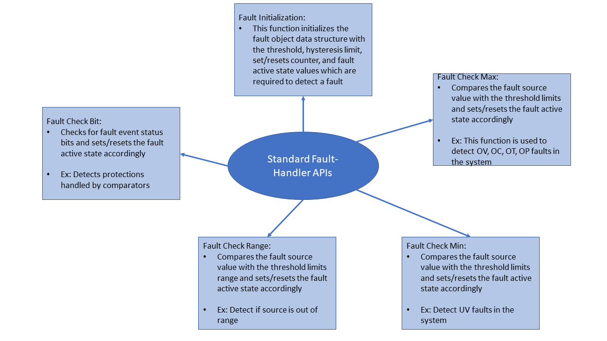

  

    

    
    

  

# Getting Started

The following section provides an introduction to the standard fault handler.

## Overview 
The Standard fault handler uses a fault object data structure, various functions which are used to
check and handle the faults in the system. Below are the features of these functions. 
- Initializes the fault object data structure with the values that are required to check/detect a fault. 
- Compares the input source value with the max threshold limits and sets/resets a fault accordingly. 
- Compares the input source value with the min threshold limits and sets/resets a fault accordingly. 
- Checks whether the input source value is out of range threshold limits and sets/resets a fault accordingly.
- Some of these functions use call back function which is used to quickly shutdown the system, if needed when a fault is detected. 

      

        
      

    

    

<i> Standard Fault Handler  </i>

The detailed description of each fault handler function is provided in the Fault Handler software overview section.